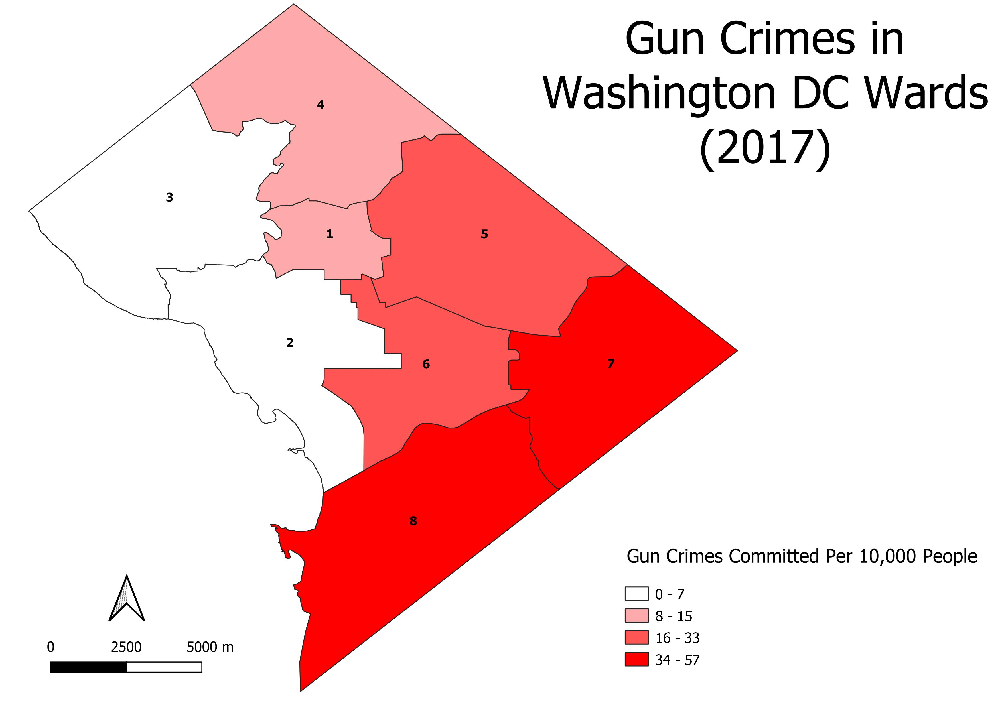
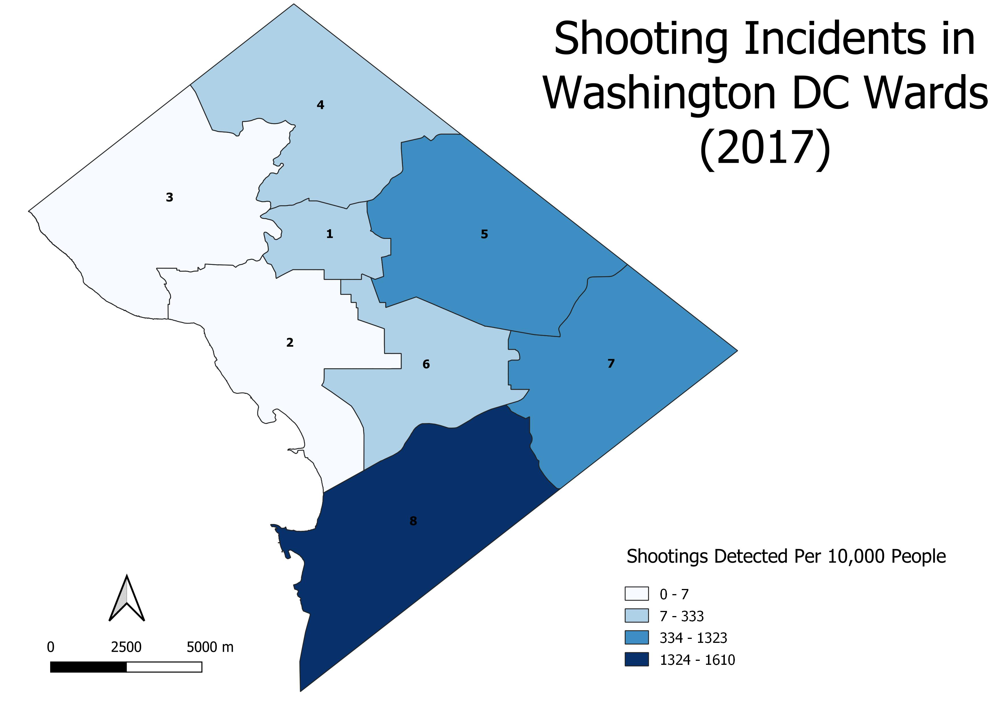

[title]

Stephanie George

August 4, 2019

INTRODUCTION

Time and budget permitting, many Police Departments consider the best method to expand gunshot detection networks within their jurisdictions. Sensor networks being used currently, such as the Shot Spotter, are allocated to the areas that see the highest crime rates in an area, historically. 
The Washington DC Metropolitan Police Department intends on expanding the Shot Spotter detection network into areas that are not currently covered, but still see significant gun crimes. By utilizing Open Data DC, information showing the locations of Shot Spotter Gun Shots, a polygon layer representing boundaries of DC's 2012 election wards, and a layer of the 2017 DC Crime points were used to analyze areas with the most need of the Shot Spotter gunshot detection network in DC. 

ANALYSIS

Gathered from Open Data DC, a website housing hundreds of datasets provided by the District of Columbia government, three valuable datasets were used to conduct this analysis. First, the Shot Spotter Gun Shots (https://opendata.dc.gov/datasets/shot-spotter-gun-shots)
dataset provides coverage for most of DC. The Shot Spotter gunshot detection system is described as an "acoustic surveillance technology that uses sensors to detect, locate and alert law enforcement agencies of potential gunfire incidents in real time" (https://opendata.dc.gov/datasets/shot-spotter-gun-shots). The next dataset used is the Ward from 2012 (https://opendata.dc.gov/datasets/ward-from-2012), a polygon layer representing the boundaries of DC's eight election wards, created as part of the DC Geographic Information System (DC GIS). Lastly, the Crime Incidents in 2017 (https://opendata.dc.gov/datasets/crime-incidents-in-2017) dataset contains a subset of locations and attributes of crime incidents reported in the ASAP (Analytical Services Application) crime report database by the DC Metropolitan Police Department (MPD). 
Two choropleth maps were made using the above three datasets. The first thematic map, shown below, renders the Gun Crimes committed per 10,000 people across DC’s eight election wards. Combined 2011 and 2012 population data found in the attribute table of the Ward from 2012 dataset were used to determine Gun Crimes per 10,000 people.  

AUTOMATION

In addition to manually analyzing ShotSpotter data using QGIS, python was also utilized to automatically import the datasets and calculate crimes and shooting incidents per 10,000 people. In order to import all three datasets, the following code was used:

                      import processing
                      crime = "E:/682Final/Crime_Incidents_in_2017.shp"
                      iface.addVectorLayer(crime, "Crime", "ogr")
                      
The first line of coding imports QGIS processing tools so that a shapefile may be saved as a new variable in the second line. The iface.addVectorLayer function adds the newly saved shapefile to the map. The second and third lines were repeated for the other two datasets, election wards and shots detected. All three datasets were saved and displayed on QGIS.

To automatically calculate gun crimes per 10,000, the previous code was recycled to save and display the dataset with three new fields added to the attribute table. 

                      iface.showAttributeTable(vlayer)
                      for field in vlayer.fields(): print(field.name())
                      
By using the iface.showAttributeTable function, the layer’s attribute table is able to be opened automatically. To get a list of the attribute names printed to the console, we can go through the layer’s fields provided by the feature() function. The second line of code can be read as: For each field in the vector layer’s fields, print the field name. Similarly, the attribute value of the layer’s features may be printed using the getFeatures() function:

                      for feature in vlayer.getFeatures(): 
                          print(feature["POPULATION"])
                          
Finally, the two lines of code above can be tweaked to divide two fields in the attribute table together as such:

                      for feature in vlayer.getFeatures():
                          print(feature["Total_GC"] / feature["POPULATION"])

The results of this calculation will be printed to the console. 

